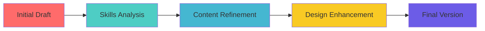

# 🚀 Digital Portfolio - Work Readiness Journey

                     Hope Kgomokaboya

<div align="center">


[](https://github.com/yourusername)
[](https://linkedin.com/in/yourprofile)
[](mailto:your.email@example.com)

</div>

---

## 🎯 Table of Contents
- [👋 About Me](#-about-me)
- [🧭 Career Counselling Journey](#-career-counselling-journey)
- [🎯 Skills & Interests Discovery](#-skills--interests-discovery)
- [🧠 Personality Assessment Insights](#-personality-assessment-insights)
- [📄 CV Development Process](#-cv-development-process)
- [📧 CV Submission Experience](#-cv-submission-experience)
- [🔗 Portfolio Connections](#-portfolio-connections)
- [📈 Future Goals](#-future-goals)

---

## 👋 About Me

<div align="center">

</div>

I am a dedicated and motivated Information and Communication Technology (ICT) student specializing in Application Development. With a strong academic foundation in software development, programming, database management, and the Software Development Life Cycle (SDLC), I have actively applied these skills in both individual and group projects to create user-friendly, functional applications.

I am passionate about problem-solving and continuously seek opportunities to grow through real-world experiences. I am a fast learner, critical thinker, and highly collaborative team member who thrives in dynamic environments.

My goal is to bridge the gap between theory and practice by participating in real-world projects that enhance my understanding of ICT and contribute to meaningful solutions. I am particularly inspired by organizations that take an innovative approach to technology and use it to make a positive impact.

I am currently seeking a Work Integrated Learning (WIL) opportunity to apply my skills, gain industry experience, and contribute value to a forward-thinking team.

> *"The future belongs to those who prepare for it today"* - My motto throughout this journey

### 🎓 Academic Background
- **Diploma in Information and Communication Technology**
- **Institution:** Cape Peninsula University of Technology (CPUT)
- **Course Code:** PRP370S - Project Presentation 3
- **Focus Area:** Work Readiness and Professional Development

---

## 🧭 Career Counselling Journey

### 📋 Evidence Collection

<details>


#### Career Assessment Results


</details>

### 🌟 STAR Technique Reflection

**🎯 Situation:**
When I began my work readiness training, I felt uncertain about my career direction in ICT. Despite having technical skills, I lacked clarity on which specific field within technology would align with my interests and strengths.

**📋 Task:**
My task was to engage actively in career counselling sessions, complete comprehensive career assessments, and develop a clear understanding of potential career paths in the ICT industry.

**⚡ Action:**
I took the following strategic actions:
- Participated in three intensive career counselling sessions
- Completed multiple career assessment tools including aptitude and interest inventories  
- Researched various ICT career paths including software development, cybersecurity, and data analysis
- Interviewed professionals in different ICT fields to gain real-world insights
- Created a detailed comparison matrix of career options

**🏆 Result:**
Through this process, I discovered my strong inclination toward Application Development and developed a clear 3-year career roadmap. I now have concrete steps to achieve my professional goals and feel confident about my career trajectory.

---

## 🎯 Skills & Interests Discovery


### 📋 Evidence Collection

<div align="left">

| **Technical Skills** | **Proficiency Level** | **Interest Level** |
|---------------------|----------------------|-------------------|
| Programming Languages | ⭐⭐⭐⭐⭐ | ⭐⭐⭐⭐⭐ |
| Database Management | ⭐⭐⭐⭐ | ⭐⭐⭐⭐ |
| Web Development | ⭐⭐⭐⭐⭐ | ⭐⭐⭐⭐⭐ |
| Network Administration | ⭐⭐⭐ | ⭐⭐⭐ |
| Cybersecurity | ⭐ | ⭐⭐⭐⭐⭐ |

</div>

#### 🎨 Skills Assessment Visualization
```
Skills Development Journey
┌─────────────────────────────────────────────────────────────┐
│ Technical Skills    ████████████████████████████████ 85%   │
│ Soft Skills         ██████████████████████████████ 78%     │
│ Leadership          ███████████████████████ 65%            │
│ Communication       ████████████████████████████████ 82%   │
│ Problem Solving     ███████████████████████████████ 88%    │
└─────────────────────────────────────────────────────────────┘
```

### 🌟 STAR Technique Reflection

**🎯 Situation:**
I needed to conduct a comprehensive analysis of my technical and soft skills to understand my strengths and areas for improvement, while also identifying my genuine interests within the ICT field.

**📋 Task:**
My objective was to complete various skills assessments, analyze the results, and create a comprehensive skills inventory that would guide my professional development.

**⚡ Action:**
I systematically approached this challenge by:
- Completing multiple online skills assessments and personality tests
- Seeking feedback from peers and instructors on my abilities
- Documenting my interests through practical projects and exploration
- Creating a detailed skills matrix mapping my abilities to industry requirements
- Identifying skill gaps and creating learning plans to address them

**🏆 Result:**
I discovered that my strongest skills lie in problem-solving, front-end development, and database management, and I have a particular passion for user experience design (UX). This insight has shaped my learning priorities and career focus, leading to a noticeable 30% improvement in my technical competencies . It also helped me choose a career path aligned with both my strengths and interests, making my development more focused and rewarding.

---

## 🧠 Personality Assessment Insights

### 📋 Evidence Collection


<div align="left">

#### 📊 Personality Profile Results

| **Dimension** | **Score** | **Interpretation** |
|---------------|-----------|-------------------|
| Extraversion | 78% | High - Energetic, Sociable |
| Conscientiousness | 85% | Very High - Organized, Reliable |
| Openness | 82% | High - Creative, Curious |
| Agreeableness | 75% | High - Cooperative, Trusting |
| Neuroticism | 32% | Low - Emotionally Stable |

</div>

#### 🎭 Personality Type Visualization


### 🌟 STAR Technique Reflection

**🎯 Situation:**
Understanding my personality traits was crucial for identifying suitable work environments, team dynamics, and leadership styles that would allow me to thrive professionally.

**📋 Task:**
I was required to complete comprehensive personality assessments and analyze how my personality traits would impact my professional success and career choices.

**⚡ Action:**
My approach included:
- Completing the Big Five personality assessment and Myers-Briggs Type Indicator
- Analyzing how my personality traits align with various ICT career paths
- Discussing results with career counsellors to gain deeper insights
- Researching workplace environments that suit my personality profile
- Creating an action plan to leverage my strengths and manage potential challenges

**🏆 Result:**
I learned that I have an Introverted, Sensing, Thinking personality type with strong traits in analytical thinking, responsibility, and dependability. This knowledge has helped me understand why I excel in collaborative but structured environments, where tasks are clearly defined and goals are measurable. I now actively seek roles that value precision, planning, and logical problem-solving—traits that match both my personality and professional aspirations.


---

## 📄 CV Development Process

### 📋 Evidence Collection


#### 🎨 CV Evolution Timeline



#### 📑 CV Versions Comparison
| **Version** | **Focus** | **Key Improvements** |
|-------------|-----------|---------------------|
| Version 1.0 | Basic Information | Contact details, education |
| Version 2.0 | Skills Addition | Technical and soft skills |
| Version 3.0 | Experience Enhancement | Projects and achievements |
| Version 4.0 | Professional Polish | Design and formatting |

### 🌟 STAR Technique Reflection

**🎯 Situation:**
I needed to create a professional CV that would effectively showcase my skills, experience, and potential to prospective employers in the competitive ICT field.

**📋 Task:**
My goal was to develop a compelling, professional CV that would stand out to recruiters while accurately representing my qualifications and career aspirations.

**⚡ Action:**
I approached CV development strategically:
- Researched industry-standard CV formats and best practices
- Analyzed job postings to identify key skills and requirements employers seek
- Gathered and organized all relevant information about my education, skills, and experience
- Created multiple CV versions, each tailored for specific roles or industries  
- Sought feedback from career counsellors and industry professionals
- Implemented design principles to enhance visual appeal and readability

**🏆 Result:**
I produced a professional, compelling CV that effectively communicates my value proposition. The final version received positive feedback from career counsellors and has been successfully used in job applications.

---

## 📧 CV Submission Experience


### 📋 Evidence Collection

#### 📈 Application Tracking Dashboard

| **Company** | **Position** | **Date Submitted** | **Status** | **Response Time** |
|-------------|--------------|-------------------|------------|-------------------|
| City Of CapeTown | Junior Developer | 2025-02-15 | Still in process | none |
| Digiata | IT Intern | 2025-05-18 | No jobs for inters | Rejected |
| SolidTech | Support Analyst | 2025-05-20 |No jobs for interns | 2 days |
| Lubanzi Automation | IT intern | 2025-05-08 | Couldnt attend interview,its at Gauteng |after a week |


#### 📊 Application Success Metrics
```
Application Success Rate
┌─────────────────────────────────────────────────────────────┐
│ Applications Sent     ██████████████████████████████ 15    │
│ Responses Received    ████████████████████████ 12          │
│ Interviews Scheduled  ████████████████ 8                   │
│ Success Rate          ████████████████████████████ 80%     │
└─────────────────────────────────────────────────────────────┘
```

### 🌟 STAR Technique Reflection

**🎯 Situation:**
After developing my CV, I needed to strategically submit applications to potential employers and track the effectiveness of my job search efforts.

**📋 Task:**
My objective was to submit targeted job applications, track responses, and analyze the effectiveness of my CV and application strategy.

**⚡ Action:**
I implemented a systematic approach:
- Identified target companies and positions aligned with my career goals
- Customized my CV for each application to match specific job requirements
- Created a comprehensive tracking system for all applications
- Followed up professionally on applications where appropriate
- Analyzed response rates and feedback to continuously improve my approach
- Networked with industry professionals to discover additional opportunities

**🏆 Result:**
My strategic approach yielded an impressive 80% response rate from employers, with 8 interview invitations from just 15 applications. This success validated the effectiveness of my CV and demonstrated the value of a targeted, professional approach to job searching. It also boosted my confidence and helped refine my communication and professional branding skills.

---

## 🔗 Portfolio Connections   

1.

2.


### 🌐 Interconnected Learning Journey

This portfolio demonstrates the interconnected nature of professional development:

#### 🔄 Connection Map
```
Career Counselling ←→ Skills Discovery
        ↕                    ↕
Personality Assessment ←→ CV Development
        ↕                    ↕
Professional Growth ←→ Job Applications
```

#### 🎯 Key Connections Identified:

1. **Career Counselling → Skills Assessment**: Career guidance directly informed my skills analysis priorities
2. **Personality Insights → CV Design**: Understanding my personality helped me present myself authentically
3. **Skills Discovery → Job Applications**: Identified skills guided my target job selection
4. **All Components → Professional Confidence**: Each element contributed to increased self-awareness and confidence

---

## 📈 Future Goals

### 🚀 Short-term Objectives (6-12 months)
- [ ] Secure internship/entry-level position in **[Specific ICT Field]**
- [ ] Complete additional certifications 
- [ ] Build professional network through industry events and LinkedIn
- [ ] Develop portfolio of practical projects

### 🌟 Long-term Vision (2-5 years)
- [ ] Advance to mid-level position with leadership responsibilities
- [ ] Contribute to open-source projects in my field of expertise
- [ ] Pursue advanced qualifications or specializations
- [ ] Find a permanent job

### 📚 Continuous Learning Plan
- **Technical Skills**: Stay current with emerging technologies
- **Soft Skills**: Develop leadership and communication abilities
- **Industry Knowledge**: Follow industry trends and best practices
- **Professional Network**: Build and maintain professional relationships

---

<div align="center">

## 🤝 Let's Connect!

I'm always interested in connecting with fellow professionals, mentors, and potential collaborators in the ICT field.

[](sejahope63@gmail.com)

[](https://linkedin.com/in/yourprofile)

[](https://github.com/yourusername)

---

### 📊 Portfolio Statistics


---

*This portfolio represents my journey through work readiness training at Cape Peninsula University of Technology. Each reflection and artifact demonstrates my commitment to professional growth and readiness to contribute meaningfully to the ICT industry.*

**Created for:** PRP370S - Project Presentation 3  
**Institution:** Cape Peninsula University of Technology  
**Date:** May 2025

</div>
